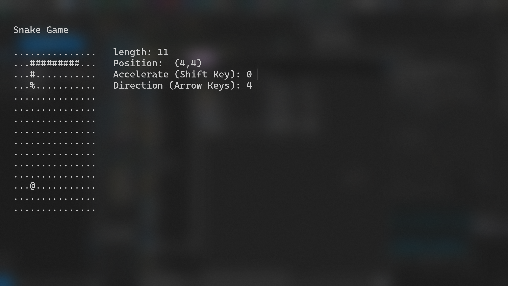
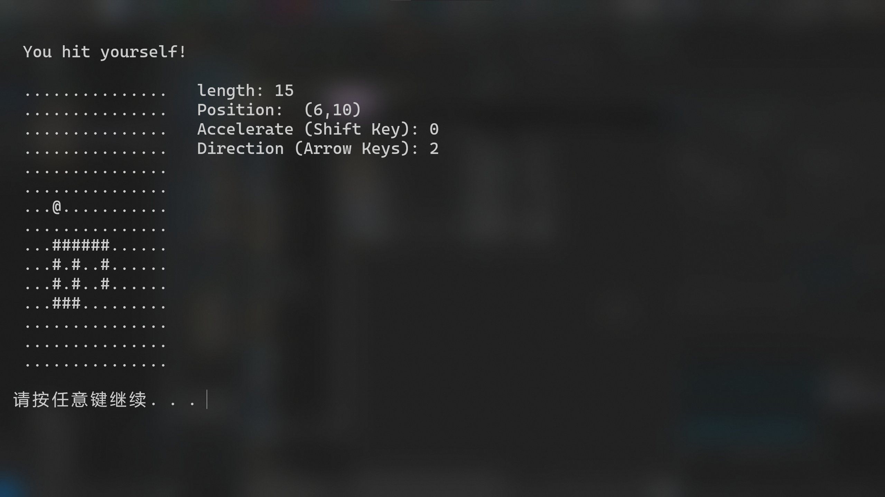

# snake-cpp

Simple snake game ran in the terminal, written with C++. 

The snake is active within a 15 * 15 grid space. The snake head '%' can move north/east/south/west (parallel to the x & y axis), the body of the snake '#' with follow the head. The goal of the game is to increase the length of the snake. 

Use arrow keys to change direction of the snake head, use shift key to change the speed.

